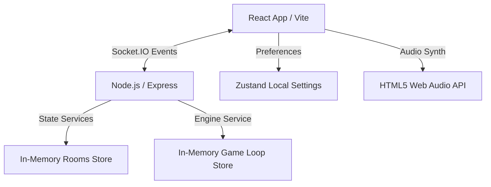

# 🎁 Mystery Box — Real-Time Multiplayer Party Game

Mystery Box is a fully responsive, animated, in-memory real-time multiplayer party game designed for **2 to 12 players**. Swap mystery boxes, trigger powerful special abilities, survive penalties, and rack up the highest coin score over several rounds to win!

No database, authentication, or account registration is required — everything runs in-memory while the server is running.

---

## 🎮 How Multiplayer Works

1. **Lobby Waiting Room**: Players enter a custom profile (nickname & avatar). The host can toggle room visibility (Public/Private), rounds limits, and kick players.
2. **Dynamic Reconnections**: If a socket disconnects, the server retains the player's presence, scores, and items for a **25-second grace period**. Reconnecting using their persistent player ID restores them to the active game without losing progress.
3. **Automatic Host Transfer**: If the host disconnects permanently or leaves the room, host status is automatically delegated to the next longest-joined active player.
4. **Countdown (5s)**: A big animated countdown ticks down to begin the round.
5. **Box Deal (4s)**: Each player is dealt a closed **Mystery Box** and one random **Special Card**.
6. **Trading Phase (45s)**: Players swap boxes. You can send, cancel, accept, or decline trade requests. Requests auto-expire in **12 seconds** if ignored.
7. **Special Card Phase (20s)**: Play your hidden ability (Shield, Steal, Double, Freeze, Reverse, etc.) on yourself or a target.
8. **Reveal Phase (7s)**: All boxes open simultaneously! Glowing rays, explosion shakes, and card calculations resolve round scores.
9. **Leaderboard (10s)**: Real-time rankings update with layout shift sorting.
10. **Winner Celebration**: Once rounds are completed, the crown winner podium displays with custom emoji confetti.

---

## 📸 Screenshots

*Placeholders for gameplay interface previews:*
```
+-------------------------------------------------------------+
|  [Round 1 / 5]         TRADING PHASE                (32s)   |
+-------------------------------------------------------------+
|                                                             |
|   🎁 [Your Closed Box]              ⚡ [Steal Card]          |
|                                                             |
|  Trading Deck:                                              |
|  +------------------+  +-----------------+  +------------+  |
|  | 🐱 BoxMaster99   |  | 🧙 Merlin       |  | 🤖 Robo    |  |
|  | [Offer Trade]    |  | [Offer Trade]   |  | [Pending]  |  |
|  +------------------+  +-----------------+  +------------+  |
+-------------------------------------------------------------+
```

---

## 🚀 Tech Stack

### Client (Frontend)
- **Vite & React 19**
- **Zustand**: Fast state stores for lobbies and game configurations.
- **Framer Motion**: Smooth page, card, list, and particle animations.
- **Web Audio API**: Procedural sound generation (no large media asset downloads).
- **Tailwind CSS**: Glassmorphic layout panels and theme styles.

### Server (Backend)
- **Node.js & Express**
- **Socket.IO**: Real-time bidirectional socket channels for player movements, chat, trading logs, and countdown loops.
- **In-Memory Store**: JavaScript `Map` objects managing active rooms, timers, and round evaluations.

---

## 🏛️ System Architecture



---

## 📂 Folder Structure

```
mystery-box/
├── .gitignore             # Root gitignore rules
├── README.md              # Detailed repository handbook
├── client/                # Client Vite project
│   ├── .env.example       # Example client environment keys
│   ├── index.html         # Main app entrypoint
│   ├── src/
│   │   ├── components/    # Reusable UI widgets
│   │   ├── context/       # Socket.IO React Context Providers
│   │   ├── hooks/         # React hooks
│   │   ├── pages/         # Screen pages
│   │   ├── store/         # Zustand store files
│   │   ├── utils/         # Procedural sound synthesizer
│   │   └── App.jsx        # Main application router
└── server/                # Server Node.js project
    ├── .env.example       # Example server environment keys
    ├── server.js          # Node app initializer
    ├── app.js             # Express middlewares and routing setup
    ├── routes/            # REST endpoint routes
    ├── services/          # Lobby and gameplay core engines
    └── socket/            # Socket.IO connection event routers
```

---

## ⚡ Socket.IO Events

### Client-to-Server (`socket.emit`)
| Event Name | Parameters | Description |
|---|---|---|
| `createRoom` | `{ playerId, name, avatar, settings }` | Creates a new game room |
| `joinRoom` | `{ roomCode, playerId, name, avatar, asSpectator }` | Joins an existing room |
| `reconnectSession` | `{ roomCode, playerId }` | Restores presence for disconnected sockets |
| `leaveRoom` | `{ roomCode, playerId }` | Leaves the room |
| `kickPlayer` | `{ roomCode, hostId, targetPlayerId }` | Kicks a player (Host only) |
| `transferHost` | `{ roomCode, hostId, targetPlayerId }` | Promotes a player to Host |
| `playerReady` / `playerUnready` | `{ roomCode, playerId }` | Toggles player ready state |
| `updateSettings` | `{ roomCode, hostId, settings }` | Updates game rounds and visibility |
| `chatMessage` | `{ roomCode, playerId, text }` | Sends chat messages |
| `startGame` | `{ roomCode, hostId }` | Transitions room to game phase |
| `tradeRequest` | `{ roomCode, senderId, receiverId }` | Sends swap request to receiver |
| `tradeAccepted` | `{ roomCode, tradeId, receiverId }` | Accepts request and swaps boxes |
| `tradeRejected` | `{ roomCode, tradeId, receiverId }` | Declines swap request |
| `tradeCancelled` | `{ roomCode, playerId }` | Cancels sent request |
| `cardPlayed` | `{ roomCode, playerId, targetPlayerId }` | Triggers a card ability |
| `playAgain` | `{ roomCode, hostId }` | Resets lobby scores and returns to lobby |

### Server-to-Client (`socket.on`)
| Event Name | Parameters | Description |
|---|---|---|
| `roomUpdated` | `room` | Broadcasts updated room structure and history |
| `chatMessageReceived` | `message` | Pushes incoming messages to chat logs |
| `publicRoomsUpdated` | `rooms` | Broadcasts active public lobbies list |
| `kicked` | `{ message }` | Notifies target player they were kicked |
| `lobbyClosed` | `{ message }` | Notifies players the room was deleted |
| `gameStarted` | `room` | Transitions screen to active gameplay dashboard |
| `phaseChanged` | `{ phase, room }` | Advances countdown, trading, and reveals |
| `timerUpdated` | `{ timer }` | Ticks countdown clocks |
| `tradeRequested` | `trade` | Prompts receiver with trade swap panel |
| `tradeRejected` | `{ tradeId }` | Alerts sender their swap request was declined |
| `tradeCancelled` | `{ playerId }` | Clears incoming prompts if sender cancels |
| `gameFinished` | `room` | Transitions screen to final winner podium |

---

## 🛠️ Installation & Running Locally

### Prerequisites
- Node.js >= 18.0.0

### Setup
1. **Clone and Install Server**:
   ```bash
   cd server
   cp .env.example .env
   npm install
   ```
2. **Install Client**:
   ```bash
   cd ../client
   cp .env.example .env
   npm install
   ```

### Running Locally
- Start Backend: `npm run dev` in `server/` (runs on `http://localhost:5000`)
- Start Frontend: `npm run dev` in `client/` (runs on `http://localhost:5173`)

### Available Scripts
- `npm run dev`: Runs local hot-reloaded development environment.
- `npm run build`: Bundles the client files into highly optimized production assets.
- `npm run lint`: Checks for quality, syntax, and formatting errors using ESLint.

---

## ⚙️ Environment Variables

### Server (`server/.env`)
- `NODE_ENV`: Application mode (`development` or `production`).
- `PORT`: Port the server listens on (default `5000`).
- `CLIENT_URL`: URL of the client application for CORS validation.

### Client (`client/.env`)
- `VITE_API_URL`: Root endpoint of the backend Express server.
- `VITE_SOCKET_URL`: Root WebSocket endpoint of the socket server.

---

## 🌐 Production Deployment

### Frontend (Vercel)
1. Import the root repository.
2. Select the `client` directory as root.
3. Configure the environment variables:
   - `VITE_API_URL`: `https://your-backend-domain.onrender.com/api`
   - `VITE_SOCKET_URL`: `https://your-backend-domain.onrender.com`
4. Deploy.

### Backend (Render)
1. Deploy as a **Web Service**.
2. Select the `server` directory as root.
3. Configure the environment variables:
   - `NODE_ENV`: `production`
   - `CLIENT_URL`: `https://your-client-domain.vercel.app`
4. Deploy.

---

## 🔮 Future Improvements
- **Achievements deck**: Badge rewards for disarming multiple bombs or stealing golden chests.
- **Interactive minigames**: Quick reaction speed tasks during the trading phase to win visual hint modifiers.
- **Custom Card Decks**: The host can choose card theme sets before launching.

---

## 📄 License

This project is licensed under the MIT License.

---

## 👥 Contributors
- **Antigravity & Pair-programmers**
# mystery-box

